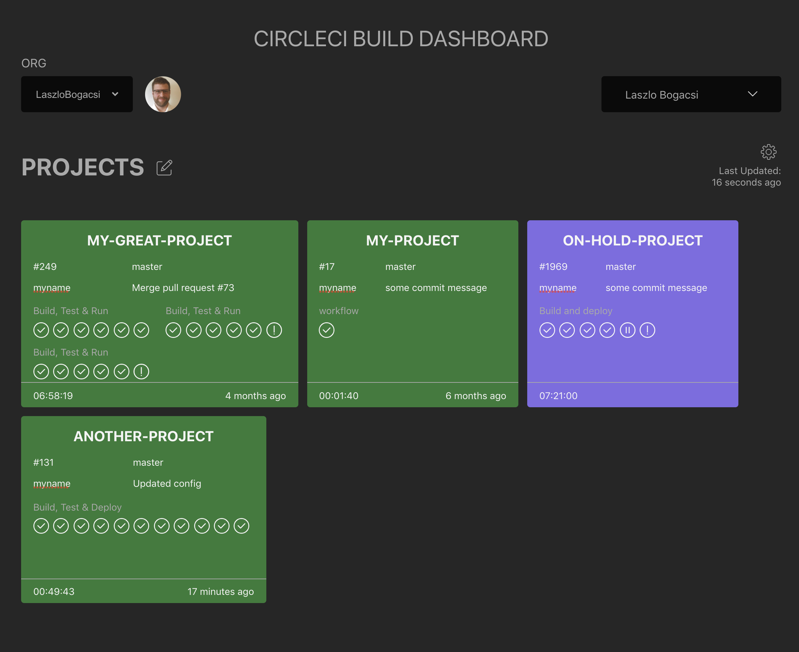
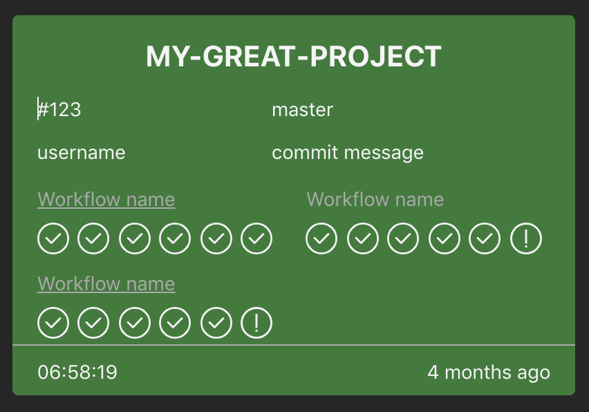
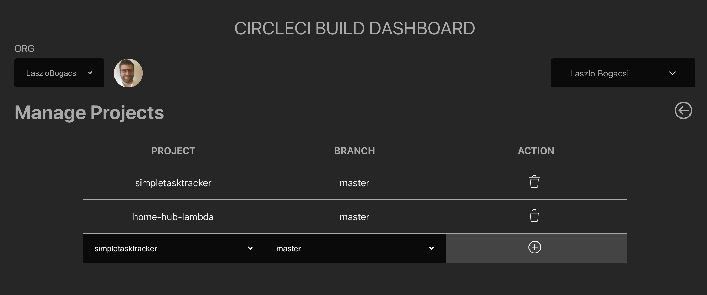

# CircleCI Dashboard

A build monitor / dashboard for multiple circle ci projects.

Leverages the CircleCi v2 API

##`Prerequisites`
```text
Circle CI account and API key
```


##`Technologies`
```text
NodeJS
React + Typescript

```

##`Local Development`
`API`
```shell
cd circleci-dashboard-api
npm i 
npm start
```
The API will launch on PORT `4000`
`UI`
```shell
cd circleci-dashboard-ui
npm i 
npm start
```
The UI will launch on PORT `3000`

##`UI Screenshots`

<p>
    
    
    
</p>

